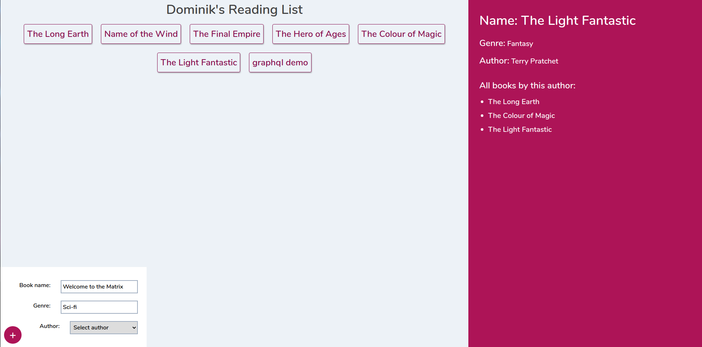

# GraphQL Booklist

A repo where I implement the project build by The Net Ninja in his [GraphQL series](https://www.youtube.com/playlist?list=PL4cUxeGkcC9iK6Qhn-QLcXCXPQUov1U7f) (Watch the playlist in one single video [here](https://www.youtube.com/watch?v=ed8SzALpx1Q). I'll use the repo to learn how to make a full stack application using React and the Apollo GraphQL client for the front end and a NodeJS, Express and GraphQL application with a MongoDB database hosted on MongoDB Cloud (formerly mLab).
